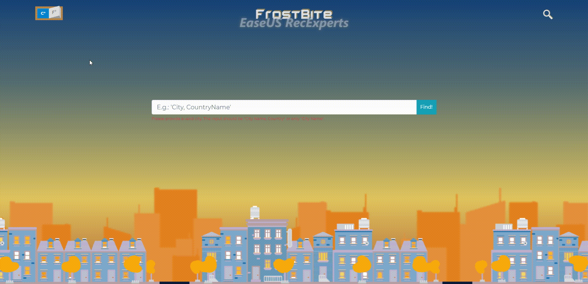
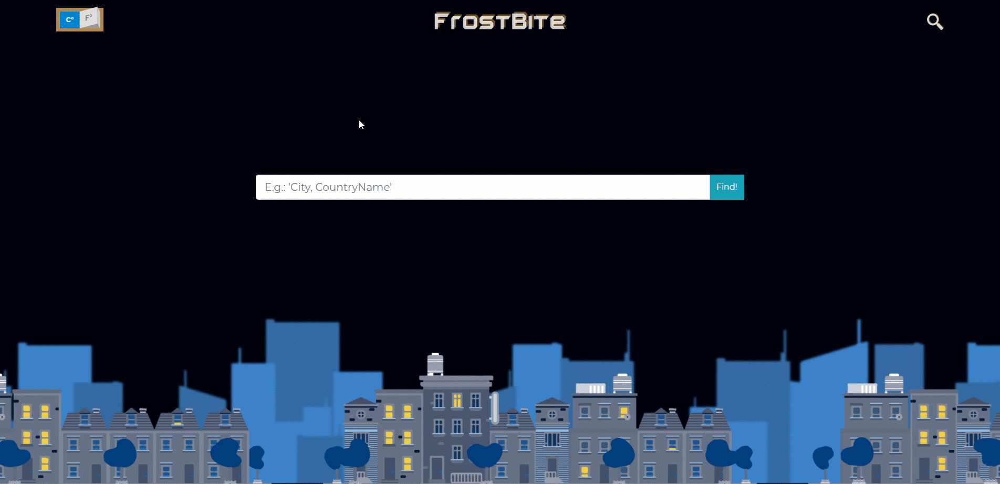

# Frostbite - Weather-App - JS

> JavaScript project which works by calling OpenWeatherMaps free API for current weather information.

## Features

- Search for current weather just typing the City name.
- Search for current weather typing City Name, Country name
- Usage of iso-3166 (Alpha-2) for country calls.
- Background color gradient changes every half-hour of the visitor current time.
- Background illustrations (buildings) change colors between 3 differents regarding visitor Time of Day.
- Change the measurement of the current temperature between Celsius and Farenheit.
- Current data shown contains current weather, place, temperatures, wind (speed and direction), humidity and pressure.

## Day:

## Dawn-Sunset:

## Night:


## Built With

- JavaScript (ES6)
- Node.js
- Webpack
- Bootstrap
- Animate.css
- Weather-Icons
- Date-fns
- SCSS
- HTML
- ESLint
- Stylelint

## Live Demo

- You can click on this [link](https://bismarck-gm.github.io/FrostBite-JS-WeatherAPP/)

## Getting Started

### Prerequisites

- Node.js
- Any Browser

To get started open the directory where you will save this repo by typing on your terminal:

```
$ cd <directory>
```

- Clone the repo typing:

```
$ git clone git@github.com:Bismarck-GM/FrostBite-JS-WeatherAPP.git
```

- Install dependencies:

```
$ npm install
```

### Usage

Start the server:

```
$ npm run server
```

Open `http://localhost:8080/` in your browser.

## Author

👤 **Gerónimo Morisot**

- Github: [@Bismarck-GM](https://github.com/Bismarck-GM)
- Twitter: [@Rewritablee](https://twitter.com/Rewritablee)
- Linkedin: [geronimomorisot](https://linkedin.com/in/geronimomorisot)

## 🤝 Contributing

Contributions, issues and feature requests are welcome!

## Show your support

Give a ⭐️ if you like this project!
Feel free to check the [issues page](issues/).

## Acknowledgments

- Project requested by [Microverse Program](https://www.microverse.org/).

## 📝 License

This project is [MIT](lic.url) licensed.
